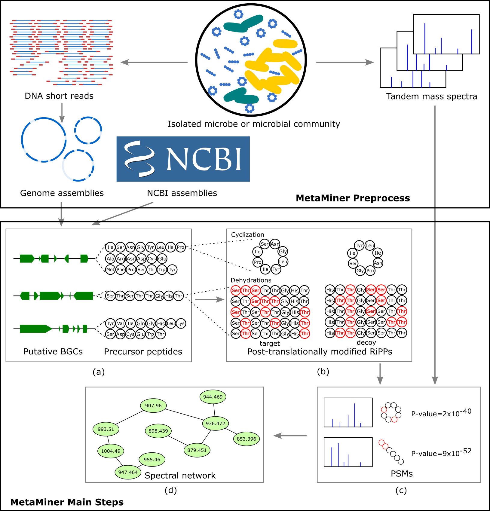

__MetaMiner User Guide v.1.0.1__

[MetaMiner](https://doi.org/10.1016/j.cels.2019.09.004) is currently available as a [workflow](https://gnps.ucsd.edu/ProteoSAFe/index.jsp?params=%7B%22workflow%22:%22RIPPQUEST%22%7D) at the Global Natural Products Social Molecular Networking (GNPS). Please see the details of how to run the workflow at [GNPS Documentation](https://ccms-ucsd.github.io/GNPSDocumentation/metaminer/)

